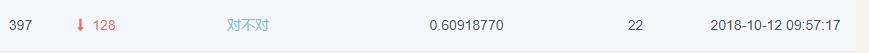
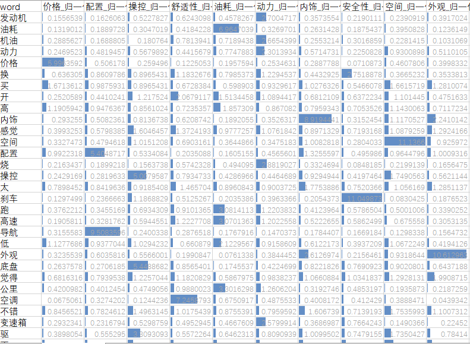
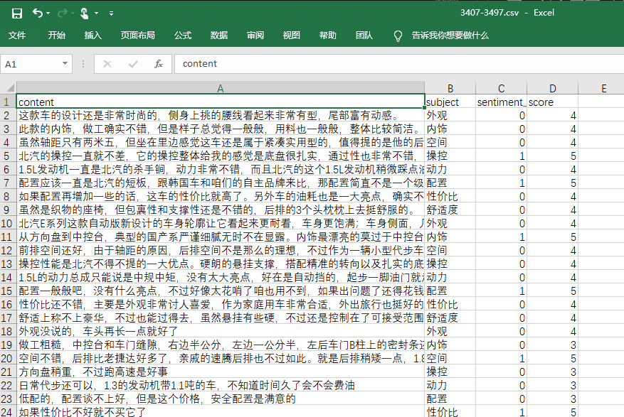
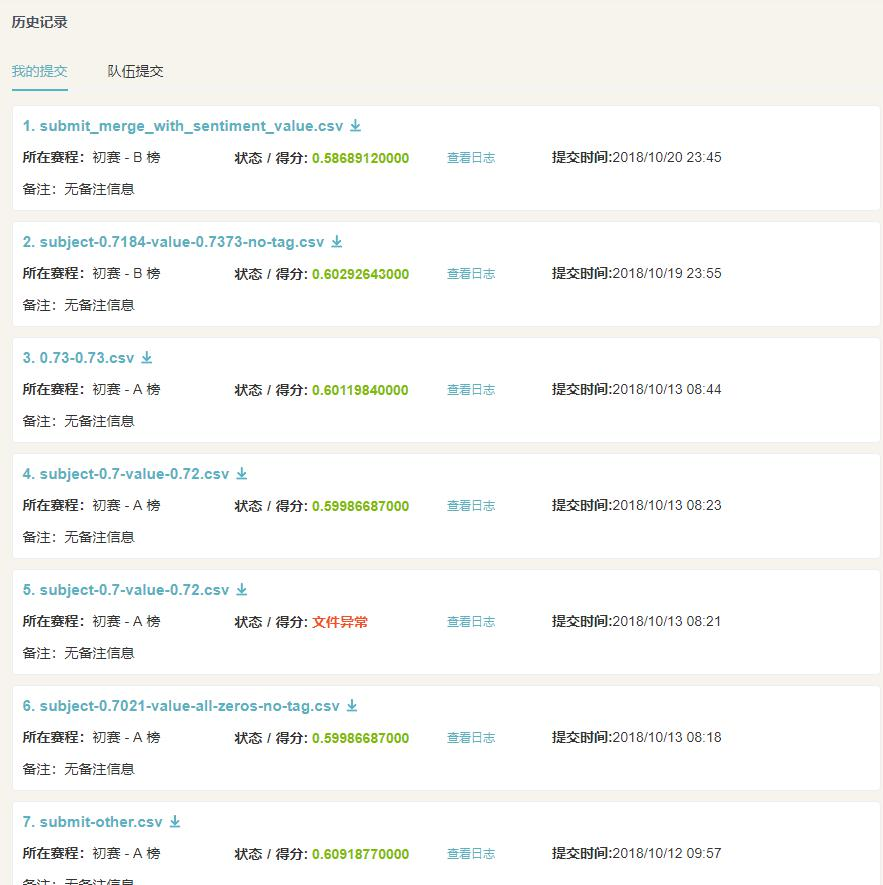

<center><h1 style="font-size:40px">数据科学实验报告</br>汽车行业用户观点主题及情感识别</h1></center>
<!-- TOC -->

- [1. 小组成员](#1-小组成员)
- [2. 分工情况](#2-分工情况)
- [3. 比赛情况](#3-比赛情况)
- [4. 问题定义](#4-问题定义)
    - [4.1. 背景](#41-背景)
    - [4.2. 任务](#42-任务)
- [5. 解决思路](#5-解决思路)
- [6. 解题过程](#6-解题过程)
    - [6.1. 数据处理](#61-数据处理)
        - [6.1.1. 流程概述](#611-流程概述)
        - [6.1.2. 中文分词](#612-中文分词)
        - [6.1.3. 词性标注](#613-词性标注)
    - [6.2. 模型训练](#62-模型训练)
        - [6.2.1. 多种方法效果](#621-多种方法效果)
        - [6.2.2. 额外数据爬取](#622-额外数据爬取)
        - [6.2.3. 后续尝试改进](#623-后续尝试改进)
    - [6.3. 模型预测](#63-模型预测)
- [7. 收获总结](#7-收获总结)
- [8. 附代码](#8-附代码)
- [9. 参考资料](#9-参考资料)

<!-- /TOC -->


<a id="markdown-1-小组成员" name="1-小组成员"></a>
# 1. 小组成员
* 朱河勤 PB16030899
* 王博 PB16020870
* 周宇淮 PB16021099
* 邵毅诚 PB16021405


<a id="markdown-2-分工情况" name="2-分工情况"></a>
# 2. 分工情况
* 朱河勤: 负责整个数据的处理, 模型的训练与优化, 报告的撰写
* 王  博: 负责额外数据的爬取, 以及尝试基于 tf-idf 的分类方法,报告的撰写
* 周宇淮: 负责尝试其他模型, 尝试过 gauss-regression
* 邵毅诚: 负责联络


<a id="markdown-3-比赛情况" name="3-比赛情况"></a>
# 3. 比赛情况
我们小组选取的是  DataFountain 比赛
* 比赛名称: [汽车行业用户观点主题及情感识别](https://www.datafountain.cn/competitions/310/details)
* 队伍名: 对不对

* 比赛排名(截止时间 2018-10-25)
    * A榜: 397/1701
    * B榜: 413/1701
    * 比赛成绩: 0.609 


<a id="markdown-4-问题定义" name="4-问题定义"></a>
# 4. 问题定义


<a id="markdown-41-背景" name="41-背景"></a>
## 4.1. 背景
随着政府对新能源汽车的大力扶植以及智能联网汽车兴起都预示着未来几年汽车行业的多元化发展及转变。汽车厂商需要了解自身产品是否能够满足消费者的需求，但传统的调研手段因为样本量小、效率低等缺陷已经无法满足当前快速发展的市场环境。因此，汽车厂商需要一种快速、准确的方式来了解消费者需求。


<a id="markdown-42-任务" name="42-任务"></a>
## 4.2. 任务
本赛题提供一部分网络中公开的用户对汽车的相关内容文本数据作为训练集，训练集数据已由人工进行分类并进行标记，参赛队伍需要对文本内容中的讨论主题和情感信息来分析评论用户对所讨论主题的偏好。讨论主题可以从文本中匹配，也可能需要根据上下文提炼。


<a id="markdown-5-解决思路" name="5-解决思路"></a>
# 5. 解决思路
对于是情感计算, 与主题多标签分类, 我们首先使用了 tfidf 进行向量化, 然后用 Logistic Regression 模型进行拟合,
更进一步的, 我们尝试了词性标注, 停用词处理等等步骤
在效果不是很好的情况下, 我们考虑了是否数据太少, 所以爬取了一些数据, 进行模型的训练. 
之后我们又进行了深度学习模型的训练, 使用了多层感知机.


<a id="markdown-6-解题过程" name="6-解题过程"></a>
# 6. 解题过程


<a id="markdown-61-数据处理" name="61-数据处理"></a>
## 6.1. 数据处理


<a id="markdown-611-流程概述" name="611-流程概述"></a>
### 6.1.1. 流程概述

首先观察数据, 如对于主题的分类, 有如下的数据


然后我们考虑数据的清洗
* 去除停用词<sup>[1]</sup>
* 中文分词
* 词性标注
* tfidf 向量化


<a id="markdown-612-中文分词" name="612-中文分词"></a>
### 6.1.2. 中文分词

我们使用python 中的 jieba 程序包进行中文分词, 并且输出词性信息. 
经过停用词去除和分词, 原文和分词结果的对比如下:


<a id="markdown-613-词性标注" name="613-词性标注"></a>
### 6.1.3. 词性标注

创建许多额外基于文本的特征有时可以提升模型效果。比如下面的例子：

* 文档的词语计数—文档中词语的总数量
* 文档的词性计数—文档中词性的总数量
* 文档的平均字密度 -- 文件中使用的单词的平均长度
* 完整文章中的标点符号出现次数 -- 文档中标点符号的总数量
* 整篇文章中的大写次数—文档中大写单词的数量
* 完整文章中标题出现的次数—文档中适当的主题（标题）的总数量
* 词性标注的频率分布
* 名词数量
* 动词数量
* 形容词数量
* 副词数量
* 代词数量


<a id="markdown-62-模型训练" name="62-模型训练"></a>
## 6.2. 模型训练


<a id="markdown-621-多种方法效果" name="621-多种方法效果"></a>
### 6.2.1. 多种方法效果
考虑到是多标签<sup>[2]</sup>进行分类, 我们将结果标签化, 使用 0~9 分别代替各个类. 然后在选择模型时, 我们考虑了 `Logistic Regression` 和  `support vector machine`, 两种效果相差不大, LR 稍微好一点. 

如下是训练 LR 模型的评估结果
```
training:  subject
             precision    recall  f1-score   support

          0       0.83      0.82      0.82       400
          1       0.62      0.47      0.54       177
          2       0.64      0.84      0.72       797
          3       0.58      0.46      0.51       147
          4       0.71      0.59      0.64       166
          5       0.55      0.57      0.56       283
          6       0.85      0.77      0.81       328
          7       0.57      0.53      0.55       135
          8       0.73      0.53      0.62       281
          9       0.79      0.68      0.73       271

avg / total       0.70      0.69      0.69      2985

training:  sentiment_value
             precision    recall  f1-score   support

          0       0.68      0.08      0.15       480
          1       0.72      0.97      0.82      2021
          2       0.54      0.23      0.32       484

avg / total       0.68      0.71      0.63      2985
```

后来, 我们又尝试了基于 tf-idf 的分类方法, 类似检索的方式, 找到最有可能的分类. 得到索引文件如下: 


通过该文件, 可以比较清楚的知道单个单词在不同类别中的比例. 在自己的训练/测试集划分上, 达到F1=0.74, 但是在线测试 F1 是 0.55.

后来我们尝试了 多层感知机 (MLP) 模型, 下面是训练 40 个 episodes 的 loss, val_loss 数据


出现了过拟合现象，训练集的 loss 已经降到 0 了，但是验证集的 val_loss 一直在上升，因此这不是一个很好的模型，因为它太过拟合了.

我们猜测可能是数据太少的原因, 
后来我们尝试了在相似的汽车评论网站自己爬取一些数据。


<a id="markdown-622-额外数据爬取" name="622-额外数据爬取"></a>
### 6.2.2. 额外数据爬取

在 https://auto.news18a.com/ 这个网站上，我们找到了有类似格式的数据，我们打算将网站上的评论数据爬去下来。

我们需要的是对汽车各个指标的评论数据。这个网站对每种型号的车有一个页面，每个页面下方，通过点击可以拉取评论。

爬取的流程如下：

1. 在这个网站上找到足够数量的，各种品牌的汽车页面
2. HTTP请求下载汽车页面中，获取拉取评论所需的参数
3. 根据参数，发送HTTP请求，调用网站API拉取评论
4. 对拉取的原始数据进行处理，将有用的按照格式写入csv文件

通过观察网页URL参数，该网站的每种型号的车对应一个4位数ID号。但是有些ID号码不对应汽车。

于是，我首先写了一个脚本，检查了ID号码为2000-4000的页面，忽略404，得到了一个可用ID列表.

接下来，通过另外一个脚本，从这些ID拉取全部评论. 由于评论时间跨度长, 较老老的评论和现在的格式不同, 因此适当舍弃一些或者转换一部分. 

爬取的部分数据如图所示:


爬取完成后, 对爬取条目进行抽样统计, 大致得到爬取数据的各个标签比例:


出现这个问题, 是由于该网站老版本评论是大部分, 但是老版本的评论不包括油耗类别. 

因此, 在筛选训练数据时, 除油耗外, 选择较少比例的数据, 尽量使得最终用于训练的数据平衡. 


<a id="markdown-623-后续尝试改进" name="623-后续尝试改进"></a>
### 6.2.3. 后续尝试改进

在这个过程中我们尝试了调整一些超参数, 比如神经网络的层数, dropout 层数, 输入结点数量等等.
然而效果仍然不佳, 于是我们提交结果的时候仍然用的 LR 模型

训练好的模型要保存<sup>[3]</sup>下来, 以供后面环节使用.


<a id="markdown-63-模型预测" name="63-模型预测"></a>
## 6.3. 模型预测
上面训练好的模型, 导入测试数据, 进行预测, 得到提交的结果
并提交了很多次, 如下图
 


同样的办法, 我们先进行了主题的预测, 后来又进行了评论情感的预测<sup>[4]</sup>. 考虑到数据的特别, 0(即中性) 非常多, 我们最开始提交的是全是0 的数据, 后来进行了预测, 结果相差不大. 这里体现可以根据数据的特点进行启发式的预测


<a id="markdown-7-收获总结" name="7-收获总结"></a>
# 7. 收获总结
在参与这个比赛的过程中, 我们对数据科学的认识更进一步了. 
我们知道数据科学
* 最耗时的步骤在数据处理部分, 是否有好的数据, 是否结合了特定场景的信息, 是否进行了数据集的划分

* 关键点在模型的训练, 模型是否合适, 该怎样有方向地调参(而不出盲目地), 是否尝试多种模型等等

* 模型的改进与评测是不可或缺的环节. 如何评测这个模型的好坏, 如何对比不同模型的优劣, 如何根据训练结果改进模型等等


<a id="markdown-8-附代码" name="8-附代码"></a>
# 8. 附代码
* lr.py: 使用了 tfidf, LR 模型
* kfold.py: 使用了 k 折交叉验证, 分别预测了多个结果, 取最可能的结果 
* mlp.py: 多层感知机模型
* tagging.py: 词性标注模块
* multi_label_evaluation.py: 多标签的评测方法, 包括 `f1`, `hamming distance`, `jaccard`


<a id="markdown-9-参考资料" name="9-参考资料"></a>
# 9. 参考资料
1. [中文常用停用词
](https://github.com/goto456/stopwords/blob/master/%E4%B8%AD%E6%96%87%E5%81%9C%E7%94%A8%E8%AF%8D%E8%A1%A8.txt)

2. Shivam Bansal [手把手教你在 Python 中实现文本分类（附代码、数据集](https://yq.aliyun.com/articles/593627)

3. 拾毅者  [机器学习 - 训练模型的保存与恢复](https://blog.csdn.net/Dream_angel_Z/article/details/47175373)

4. wiki  [文本情感分析](https://zh.wikipedia.org/wiki/%E6%96%87%E6%9C%AC%E6%83%85%E6%84%9F%E5%88%86%E6%9E%90)